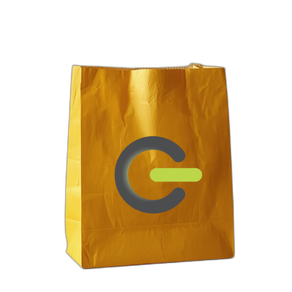

# Gioxx's Wall Amazon Affiliate Tag Replacer

Estensione browser che aggiunge o sostituisce il parametro `tag` sui link Amazon.it con il codice affiliato di Gioxx's Wall, evitando le aree sensibili di login e checkout.

## Come funziona
- Ambito: solo domini `amazon.it` (schede e frame).
- Tag applicato: `gioxx-21`.
- Esclusioni: non interviene su percorsi di login (`/ap/`, `/gp/sign-in`) e checkout (`/checkout/`, `/gp/buy/`).
- Trasparenza: nessun dato personale raccolto o inviato; l'estensione si limita a modificare gli URL.
- Pagina informazioni: `about.html` accessibile dalle opzioni dell'estensione.

## File principali
- `manifest.json`: manifest MV3 per Chrome/Edge con `declarativeNetRequest` e `rules.json`.
- `rules.json`: regola di redirect che imposta/aggiorna il parametro `tag`, con filtro regex e percorsi esclusi.
- `manifest.firefox.json`: manifest MV2 per Firefox, usa `webRequest`/`webRequestBlocking` e `background.js`.
- `background.js`: listener che riscrive l'URL su Firefox rispettando le stesse esclusioni.
- `about.html`: pagina "About" con descrizione, tag in uso e note di trasparenza.
- `icons/`: asset di base `Amazon_Tag_Replacer_noBG.png` e derivati `icon16.png`, `icon48.png`, `icon128.png` usati nei manifest.
